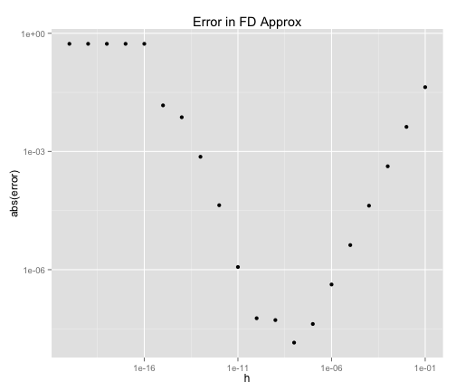

Discretization Error
========================================================

This is an example of what can happen when one doesn't pay attention to subtleties of finite precision.  Let's try to compute the derivative of sin(x) using forward finite differences.

First initialize the vectors.  We will approximate the derivative about the point x = 1

```r
x <- 1
```

Set up a vector, h,  with values from $10^{-1}$ to $10^{-20}$

```r
t <- seq(1:20)
h <- 10^-t
h
```

```
##  [1] 1e-01 1e-02 1e-03 1e-04 1e-05 1e-06 1e-07 1e-08 1e-09 1e-10 1e-11
## [12] 1e-12 1e-13 1e-14 1e-15 1e-16 1e-17 1e-18 1e-19 1e-20
```


Now compute the finite difference approximation to the derivative of sin(x) about x = 1, varying h


```r
diff_quo <- (sin(x + h) - sin(x))/h
diff_error <- abs(cos(x) - diff_quo)
```


```r
library(ggplot2)
```

```
## Warning: package 'ggplot2' was built under R version 2.15.2
```

Plot the error between $cos(x) = \frac{dsin(x)}{dx}$ and the finite difference approximation

```r
qplot(x = h, y = diff_error, log = "xy", main = "Error in FD Approx", ylab = "abs(error)")
```

 


